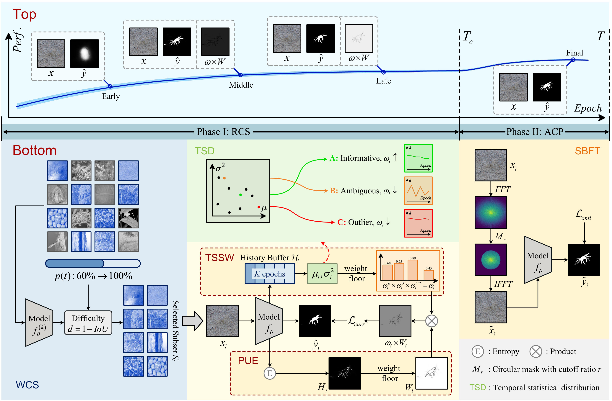
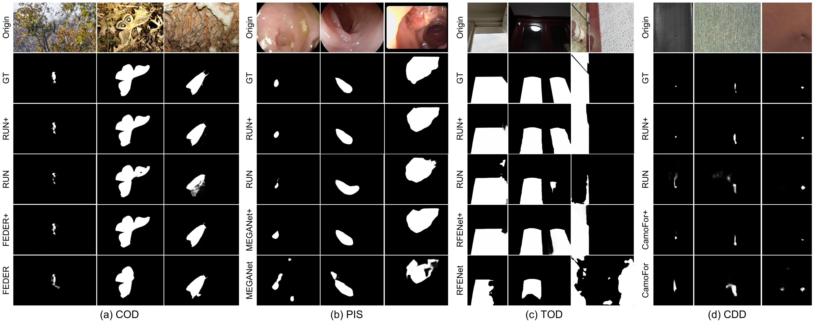

# CurriSeg

**Refining Context-Entangled Content Segmentation via Curriculum Selection and Anti-Curriculum Promotion**, ICML 2026

[[Project Page](https://zrh-ahu.github.io/Curriseg/)] [[Paper](assets/paper.pdf)] [[Results](#results-download)] [[Pretrained models](#pretrained-models)]

#### Authors
[Chunming He](https://chunminghe.github.io/)\*, Rihan Zhang\*, Fengyang Xiao†, Dingming Zhang, Zhiwen Cao, Sina Farsiu†

\* Equal contribution. † Corresponding authors.

#### Affiliations
Duke University, Adobe

---

> **Abstract:** *Biological learning proceeds from easy to difficult tasks, gradually reinforcing perception and robustness. Inspired by this principle, we address Context-Entangled Content Segmentation (CECS), a challenging setting where objects share intrinsic visual patterns with their surroundings, as in camouflaged object detection. Conventional segmentation networks predominantly rely on architectural enhancements but often ignore the learning dynamics that govern robustness under entangled data distributions. We introduce CurriSeg, a dual-phase learning framework that unifies curriculum and anti-curriculum principles to improve representation reliability. In the Curriculum Selection phase, CurriSeg dynamically selects training data based on the temporal statistics of sample losses, distinguishing hard-but-informative samples from noisy or ambiguous ones, thus enabling stable capability enhancement. In the Anti-Curriculum Promotion phase, we design Spectral-Blindness Fine-Tuning, which suppresses high-frequency components to enforce dependence on low-frequency structural and contextual cues and thus strengthens generalization. Extensive experiments demonstrate that CurriSeg achieves consistent improvements across diverse CECS benchmarks without adding parameters or increasing total training time, offering a principled view of how progression and challenge interplay to foster robust and context-aware segmentation.*

<p align="center">
  
</p>

---

## Highlights

- **CurriSeg** is a dual-phase learning framework for Context-Entangled Content Segmentation (CECS).
- **Robust Curriculum Selection (RCS)** stabilizes training with temporal sample statistics and pixel-level uncertainty estimation.
- **Anti-Curriculum Promotion (ACP)** improves robustness through Spectral-Blindness Fine-Tuning (SBFT), encouraging low-frequency structural reasoning.
- The framework improves diverse CECS benchmarks without introducing extra inference parameters.

## Visual Comparison

<p align="center">
  
</p>

## Usage

### 1. Prerequisites

> CurriSeg is developed with PyTorch and tested for research use on GPU environments.

- Create a virtual environment:

```bash
conda create -n curriseg python=3.8
conda activate curriseg
```

- Install dependencies:

```bash
pip install -r requirements.txt
```

### 2. Downloading Training and Testing Datasets

- Prepare the training set with the following structure:

```text
YOUR_TRAININGSETPATH/
  Imgs/
  GT/
  Edge/
```

- Prepare the validation and testing sets with the following structure:

```text
YOUR_VALIDATIONSETPATH/
  Imgs/
  GT/

YOUR_TESTINGSETPATH/
  CAMO/
    Imgs/
    GT/
  COD10K/
    Imgs/
    GT/
  CHAMELEON/
    Imgs/
    GT/
  NC4K/
    Imgs/
    GT/
```

Common CECS/COD benchmarks can be obtained from their official project pages or the [awesome-camouflaged-object-detection](https://github.com/visionxiang/awesome-camouflaged-object-detection) collection.

### 3. Training Configuration

Run the curriculum selection phase:

```bash
python Train.py \
  --epoch 300 \
  --lr 1e-4 \
  --batchsize 36 \
  --trainsize 384 \
  --train_root YOUR_TRAININGSETPATH \
  --val_root YOUR_VALIDATIONSETPATH \
  --save_path YOUR_CHECKPOINTPATH
```

Run the anti-curriculum promotion phase:

```bash
python anti_curri_stage.py \
  --epoch 100 \
  --lr 5e-5 \
  --batchsize 36 \
  --trainsize 384 \
  --train_root YOUR_TRAININGSETPATH \
  --val_root YOUR_VALIDATIONSETPATH \
  --save_path YOUR_ANTI_CURRI_CHECKPOINTPATH \
  --load YOUR_CHECKPOINTPATH/Net_epoch_best.pth \
  --use_sbft
```

### 4. Testing Configuration

The pretrained models will be released soon. After downloading a checkpoint, run:

```bash
python Test.py \
  --testsize 384 \
  --pth_path YOUR_CHECKPOINTPATH/Net_epoch_best.pth \
  --test_dataset_path YOUR_TESTINGSETPATH
```

### 5. Evaluation

One-key evaluation for COD/CECS benchmarks can be performed with the public [CODToolbox](https://github.com/DengPingFan/CODToolbox). Please follow the instructions in `main.m` to compute standard metrics.

<a id="results-download"></a>

### 6. Results Download

Prediction results will be released soon.

<a id="pretrained-models"></a>

### 7. Pretrained Models

Pretrained models will be released soon.

## Related Works

[Camouflaged Object Detection with Feature Decomposition and Edge Reconstruction](https://github.com/ChunmingHe/FEDER), CVPR 2023.

[Feature Shrinkage Pyramid for Camouflaged Object Detection with Transformers](https://github.com/ZhouHuang23/FSPNet), CVPR 2023.

[Concealed Object Detection](https://github.com/GewelsJI/SINet-V2), TPAMI 2022.

You can find more related papers in [awesome-COD](https://github.com/visionxiang/awesome-camouflaged-object-detection).

## Citation

If you find our work useful in your research, please consider citing:

```bibtex
@inproceedings{he2026curriseg,
  title={Refining Context-Entangled Content Segmentation via Curriculum Selection and Anti-Curriculum Promotion},
  author={He, Chunming and Zhang, Rihan and Xiao, Fengyang and Zhang, Dingming and Cao, Zhiwen and Farsiu, Sina},
  booktitle={International Conference on Machine Learning (ICML)},
  year={2026}
}
```

## Contact

If you have any questions, please contact Fengyang Xiao at fengyang.xiao@duke.edu or Sina Farsiu at sina.farsiu@duke.edu.

## Acknowledgement

This repository follows the research code style of prior CECS/COD projects such as [FEDER](https://github.com/ChunmingHe/FEDER) and related open-source segmentation frameworks. We sincerely thank the authors for their valuable contributions to the community.
